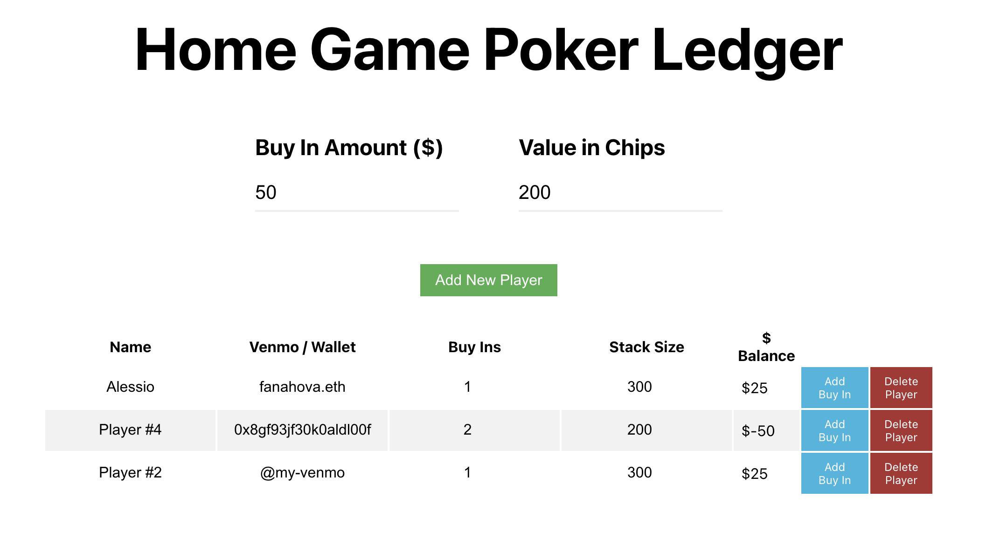

# Poker Home Game Ledger

Simple ledger for poker home games. How to use it:
- Run locally with `yarn dev` 
- Use "Deploy to Netlify" button above, it takes ~30 seconds to go from click to live
- Use the hosted version at https://poker.alessiofanelli.com/ (might go down if bandwidth goes over)

